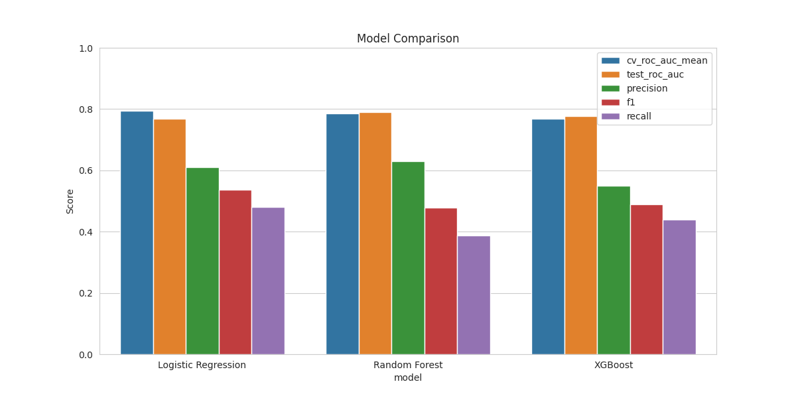

# EDA & Classification - German Credit Risk Dataset

## Summary
This project is an end-to-end analysis of the German Credit dataset from OpenML. It covers exploratory data analysis, preprocessing, model comparison, and a short business interpretation of the results.

The task is binary credit-risk classification: predict whether an applicant is a good or bad payer. The data is imbalanced, and the business cost is asymmetric, so the project treats false negatives as more expensive than false positives.

The workflow is organized into three notebooks: EDA in `01_eda.ipynb`, preprocessing in `02_preprocessing.ipynb`, and modeling in `03_modeling.ipynb`.

## Project Structure
```
├── data/
│   ├── raw/
│   └── preprocessed/
├── models/
│   └──preprocessor.joblib
├── notebooks/
│   ├── 01_eda.ipynb
│   ├── 02_preprocessing.ipynb
│   └── 03_modeling.ipynb
├── outputs/
│   └── figures/
├── results/
│   └── model_comparison.csv
├── main.ipynb
└── requirements.txt
```

---

## Notebooks
| # | Notebook | Description |
|---|----------|-------------|
| 1 | EDA | Distribution analysis, correlations, class balance |
| 2 | Preprocessing | Encoding, scaling, train/test split |
| 3 | Modeling | Model comparison, metrics, feature importance |

---

## Results

| Model | CV ROC AUC | Test ROC AUC | Recall | Precision | F1 |
|---|---:|---:|---:|---:|---:|
| Logistic Regression | 0.493 | 0.769 | 0.480 | 0.610 | 0.537 |
| Random Forest | 0.382 | 0.789 | 0.387 | 0.630 | 0.479 |
| XGBoost | 0.507 | 0.777 | 0.440 | 0.550 | 0.489 |



The three models are close enough to make this a baseline experiment, not a final optimized system. Logistic Regression is the best operational baseline here because it gives the strongest balance of recall and F1 for the bad-payer class. Random Forest has the highest test ROC AUC, so it is still a valid alternative if ranking quality is the main goal.

## Business Interpretation

This project distinguishes between class imbalance and business cost imbalance. The observed class ratio is about 70% good payers and 30% bad payers, but the business impact is not symmetric: one missed bad payer is assumed to cost about five false alarms on good payers.

That means the right evaluation focus is not accuracy alone. The more useful metrics are recall for the bad class, ROC AUC, precision, and F1, along with threshold tuning.

If we use the simple cost assumption directly, a starting threshold is:

`threshold = 1 / (1 + 5) = 0.167`

That is only a starting point, but it shows why the default 0.5 cutoff is not always the best choice for credit-risk problems.

---

## Research Questions and Answers

1. What is the class distribution?

	About 70% of the examples are good payers and 30% are bad payers.

2. Which features are most informative for risk?

	`credit_amount` and `duration` show the strongest signal in EDA.

3. Are there data quality issues?

	No major missing-value or duplicate issues were found.

4. What preprocessing is justified?

	Log transform for skewed numeric features, scaling for numeric variables, and categorical encoding with ordinal and one-hot encoders.

5. Which baseline models perform best?

	The three models are similar enough to make this a strong baseline study. Further gains are more likely to come from feature engineering, class-imbalance handling, and threshold tuning than from trying many more algorithms.

---

## Setup
```bash
pip install -r requirements.txt
```

### How to run the notebooks?
Clone the repository and run the notebooks from the project folder:

```bash
git clone https://github.com/BechiixD/german-credit-risk.git
cd german-credit-risk
jupyter notebook
```

The local server usually opens at `http://localhost:8888/`.

---

## Dataset
[Link to UCI German Credit dataset / OpenML credit-g](https://www.openml.org/search?type=data&sort=version&status=any&order=asc&exact_name=credit-g&id=31)
